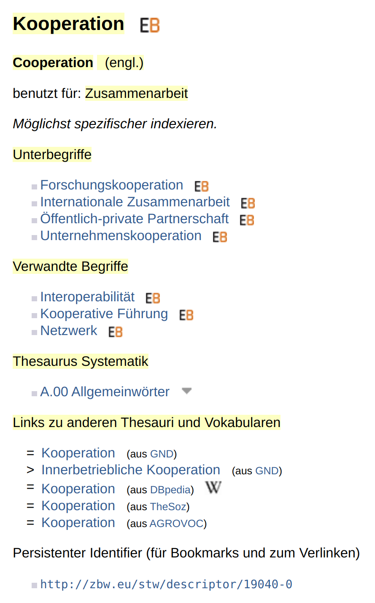

# Einführung in SKOS am Beispiel von Open Educational Resources (OER)

Diese Einführung soll die Nutzung der Beschreibungssprache **Simple Knowledge Organization System** (SKOS) für kontrollierte Vokabulare erleichtern. Wir diskutieren den Zweck und die Vorteile am Beispiel von [Open Educational Resources](https://de.wikipedia.org/wiki/Open_Educational_Resources) (OER).

Diese Seite beinhaltet einen theoretischen Überblick. Wer direkt praktisch einsteigen möchte, kann im [Tutorial](skos-tutorial.md) ein SKOS-Vokabular von Grund auf erstellen und veröffentlichen.

## Wozu kontrollierte Vokabulare?

Grob betrachtet bestehen alle Metadaten aus Elementen und zugehörigen Werten. Beispiel:

```yaml
title: Beispiel
creator: Anne
date: 2020-04-21
language: de
subject: Bauingenieurwesen
```

Um diese für Menschen gut lesbare Beschreibung konsistent innerhalb eines technischen Systems anzuwenden, wird ein Metadatenschema definiert. Dieses legt fest, welche Elemente es gibt, ob diese verpflichtend oder optional sind und welche Inhaltstypen sie haben dürfen. Ein Schema könnte vereinfacht so aussehen:

```yaml
mandatory:
  - title: string
  - creator: string
optional:
  - date: ISO8601
  - language: ISO639-1
  - subject: string
```

Hier ist die Datumsangabe nach ISO 8601 (JJJJ-MM-TT) und die Sprachangabe nach ISO 639-1 (2-stellige Sprachkürzel) formatiert. Fehlerhafte Eingaben wie `2020-21-04 ` (Monat und Tag vertauscht) oder `dd` (nicht existentes Sprachkürzel) können bei der Eingabe vom System erkannt und mit einer Fehlermeldung quittiert werden. Im Element `subject` ist jede Zeichenkette (string) erlaubt, d.h. Schreibfehler wie `Bauingeneurwesen` oder ein ähnliches Wort wie `Bautechnik` werden vom System nicht als Problem erkannt.

Nehmen wir an, wir wollen auf einem Hochschulschriftenserver die Fachdisziplin eindeutig erfassen, damit in einer Recherche danach gefiltert werden kann und in einer internen Statistik die Schriften nach Fachdisziplin gezählt werden können. Dann bietet es sich an, im Metadatenschema für das Element `subject` eine Wortliste zu definieren, die alle an der Hochschule vertretenen Fachdisziplinen beinhaltet. Wie so ein kontrolliertes Vokabular mit SKOS kodiert werden kann, wird weiter unten erläutert.

Durch die begriffliche Kontrolle werden Schreibfehler, Bedeutungs- und Bezeichnungsvielfalt vermieden. Die dadurch erzeugte Einheitlichkeit fördert die Auffindbarkeit, Maschinenlesbarkeit und Nachnutzbarkeit der Metadaten.

## Kurzbeschreibung

Simple Knowledge Organization System (SKOS) ist eine Beschreibungssprache für kontrollierte Vokabulare (Thesauri, Klassifikationen, Taxonomien usw.). Ziel des Standards ist die einfache Veröffentlichung und Nutzung von kontrollierten Vokabularen als [Linked Open Data](https://de.wikipedia.org/wiki/Linked_Open_Data). SKOS wurde 2009 [vom W3C als Empfehlung verabschiedet](https://www.w3.org/TR/2009/REC-skos-reference-20090818/) und findet seitdem zunehmende Verbreitung als Austauschformat:

* Bedeutende allgemeine kontrollierte Vokabulare (z.B. Thesaurus der UNESCO oder der EU) und zahlreiche Fachspezifische (z.B. Standard-Thesaurus Wirtschaft der ZBW oder Thesaurus Sozialwissenschaften von GESIS) wurden bereits als SKOS veröffentlicht (vgl. [Anwendungsbeispiele](skos-anwendungsbeispiele.md)).
* Die meisten aktuellen Thesaurus-Management-Systeme unterstützen SKOS. Es gibt außerdem zahlreiche Tools, welche die Veröffentlichung und Nutzung von Vokabularen als SKOS vereinfacht  (vgl. [Software](skos-software.md)).

SKOS wird im graph-basierten Datenmodell [Resource Description Framework](https://de.wikipedia.org/wiki/Resource_Description_Framework) (RDF) kodiert. Durch diese Form der Kodierung ist das Vokabular maschinenlesbar und web-kompatibel. SKOS unterstützt Mehrsprachigkeit, jeder Begriff erhält einen Identifier (URI) und Verknüpfungen mit externen Vokabularen im Web sind möglich. Als Datenformate stehen die Serialisierungen zur Verfügung, die auch RDF bietet, also [RDF/XML](RDF/XML), [N-Triples](https://format.gbv.de/rdf/ntriples), [Turtle](https://format.gbv.de/rdf/turtle), [JSON-LD](https://format.gbv.de/rdf/json-ld) und weitere.

## Verwendungszwecke

* Als Lehrende/r können Sie vorhandene SKOS-Vokabulare nutzen, um Ihre Lehrmaterialien mit geeigneten fachspezifischen Schlagwörtern (z.B. [Standard-Thesaurus Wirtschaft](http://bartoc-skosmos.unibas.ch/STW/en/?clang=de)) zu beschreiben oder bestimmten Studienfächern (z.B. [Destatis-Systematik der Studienfächer](https://skohub.io/dini-ag-kim/hochschulfaechersystematik/heads/master/w3id.org/kim/hochschulfaechersystematik/scheme.html)) zuzuordnen.
* Als Betreiber/in eines Hochschulrepositoriums können Sie vorhandene SKOS-Vokabulare nutzen, um die Materialien zu erschließen. Für die Struktur der Hochschule mit allen ihren Instituten und Forschungsbereichen können Sie ein neues SKOS-Vokabular definieren und veröffentlichen.
* Als Entwickler/in einer Infrastruktur zum Erstellen, Publizieren oder Teilen von OER können Sie SKOS-Vokabulare einbetten oder sogar die Erstellung von SKOS-Vokabularen in der Software unterstützen, um Werte in Metadaten kontrolliert zu erfassen.

## Vorteile

* Die Maschinenlesbarkeit von SKOS-Vokabularen fördert die Auffindbarkeit der Lehrmaterialien und ermöglicht das automatische Laden von vertiefenden Informationen zu den Begriffen (Lookup).
* Durch die Veröffentlichung von SKOS-Vokabularen wird die Nachnutzung der Vokabulare erleichtert und damit langfristig mehr Einheitlichkeit erzielt oder zumindest der Arbeitsaufwand beim Erstellen von Vokabularen reduziert.
* Die Unterstützung von Mehrsprachigkeit fördert die Entwicklung von international genutzten Vokabularen.
* Die Kompatibilität zum Semantic Web ermöglicht Links zu Begriffen in externen SKOS-Vokabularen oder sogar Links zu externen Webressourcen.

## Kodierung

Wie oben erwähnt, wird SKOS im graph-basierten Datenmodell RDF kodiert. Wir verwenden für die Code-Schnipsel im folgenden Beispiel die RDF-Serialisierung [Turtle](https://format.gbv.de/rdf/turtle), weil diese am besten lesbar ist. 

### RDF/Turtle

In der einfachsten Form werden in Turtle die RDF-Tripel (Subjekt, Prädikat, Objekt) direkt hintereinander mit Leerzeichen getrennt in eine Zeile geschrieben und mit einem Punkt abgeschlossen. Hier ein allgemeines Beispiel (mit [DC Terms](https://www.dublincore.org/specifications/dublin-core/dcmi-terms/) statt SKOS):

Die folgenden beiden Tripel...

| Subjekt                         | Prädikat      | Objekt       |
| ------------------------------- | ------------- | ------------ |
| `<http://example.org/beispiel>` | `dct:creator` | `"Anne"`     |
| `<http://example.org/beispiel>` | `dct:title`   | `"Beispiel"` |

werden in der einfachsten Form so kodiert:

```turtle
<http://example.org/beispiel> dct:creator "Anne" .
<http://example.org/beispiel> dct:title "Beispiel" .
```

Zur besseren Lesbarkeit verwenden wir im Folgenden eine verkürzte Form, wenn es mehrere Aussagen zum selben Subjekt gibt (Prädikat-Objekt-Paare mit Semikolon getrennt und mit Leerzeichen eingerückt):

```turtle
<http://example.org/beispiel>
    dct:creator "Anne" ;
    dct:title "Beispiel .
```

Und wenn es mehrere Objekte zu einem Prädikat gibt – wie beispielsweise einen weiteren Tripel mit dem Autor Ich (`<http://example.org/beispiel>` `dct:creator` `"Ich"`) – dann nutzen wir die folgende verkürzte Form (mehrere Objekte mit Komma getrennt):

```turtle
<http://example.org/beispiel>
    dct:creator "Anne", "Ich" ;
    dct:title "Beispiel .
```

### Beispiel Standard-Thesaurus Wirtschaft

Nun zu einem konkreten Beispiel für ein kontrolliertes Vokabular. Die Webseite zum Begriff [Kooperation im Standard-Thesaurus Wirtschaft](https://via.hypothes.is/https://zbw.eu/stw/version/latest/descriptor/19040-0/about.de.html) sieht wie folgt aus (auf die gelb markierten Wörter gehen wir gleich im Einzelnen ein):



#### Kooperation / Cooperation

Der Eintrag im Thesaurus hat den **Identifier** <http://zbw.eu/stw/descriptor/19040-0>. Dieser wird in SKOS als Ausgangspunkt genutzt (und nicht etwa der Name des Eintrags).

Die Hauptbezeichnung (**Kooperation** bzw. **Cooperation**) wird dann mit `skos:prefLabel` ergänzt.

Die verschiedenen **Sprachen** werden gemäß RDF/Turtle durch den Anhang `@de` bzw. `@en` definiert.

```turtle
<http://zbw.eu/stw/descriptor/19040-0>
    skos:prefLabel "Cooperation"@en, "Kooperation"@de .
```

#### Zusammenarbeit

Alternative Bezeichnungen werden mit `skos:altLabel` ergänzt.

```turtle
<http://zbw.eu/stw/descriptor/19040-0>
    skos:altLabel "Zusammenarbeit"@de .
```

#### Unterbegriffe

* Forschungskooperation
* Internationale Zusammenarbeit
* Öffentlich-private Partnerschaft
* Unternehmenskooperation

Zur Abbildung von Hierarchien wird in SKOS das Paar `skos:broader` ("hat einen Oberbegriff") und `skos:narrower` ("hat einen Unterbegriff") verwendet. In der fertigen Datei sollten immer beide Richtungen definiert sein, also hier im Beispiel:

* Kooperation hat den Unterbegriff (`skos:narrower`) Forschungskooperation
* Forschungskooperation hat den Oberbegriff (`skos:broader`) Kooperation

Wenn aber eine Software für die Erstellung des SKOS-Vokabulars verwendet wird, dann reicht es meist aus nur eine Richtung zu definieren, weil die andere Richtung dann automatisch von der Software ergänzt wird.

Die vier Unterbegriffe im Eintrag Kooperation würden also wie folgt definiert:

```turtle
<http://zbw.eu/stw/descriptor/19040-0>
    skos:narrower <http://zbw.eu/stw/descriptor/12036-5>, <http://zbw.eu/stw/descriptor/18775-0>, <http://zbw.eu/stw/descriptor/18822-3>, <http://zbw.eu/stw/descriptor/19708-3> .
```

#### Verwandte Begriffe

* Interoperabilität
* Kooperative Führung
* Netzwerk

Falls die Begriffe nicht in einer direkten Hierarchie zueinander stehen, sondern nur irgendwie miteinander verbunden sind, dann wird das Prädikat `skos:related` verwendet.

```turtle
<http://zbw.eu/stw/descriptor/19040-0>
    skos:related <http://zbw.eu/stw/descriptor/12580-3>, <http://zbw.eu/stw/descriptor/18657-6>, <http://zbw.eu/stw/descriptor/20402-3> .
```

#### Thesaurus Systematik

* A. 00 Allgemeinwörter

Für die Dokumentation einer Notation gibt es eigentlich das spezifische Prädikat `skos:notation`. Da die Systematikstelle im Standard-Thesaurus Wirtschaft aber eben auch eine Art Überordnung darstellt, haben sich die Autor*innen dazu entschieden, diese schlicht mit `skos:broader` zu definieren. In unserem Beispiel wird die Systematikstelle also wie folgt definiert:

```turtle
<http://zbw.eu/stw/descriptor/19040-0>
    skos:broader <http://zbw.eu/stw/thsys/70582> .
```

Auf der Webseite werden die Verweise mit `skos:broader` unter zwei Überschriften ("Oberbegriffe" und "Thesaurus Systematik") gruppiert. Wahrscheinlich erfolgt diese Gruppierung dynamisch anhand des Adressbestandteils (Oberbegriffe = `/descriptor` und Thesaurus Systematik =  `/thsys`).

#### Links zu anderen Thesauri und Vokabularen

* = Kooperation (aus GND)
* = Kooperation (aus DBpedia)
* = Kooperation (aus TheSoz)
* = Kooperation (aus AGROVOC)

Für Links zu externen SKOS-Vokabularen gibt es gleich drei Prädikate, um die Genauigkeit der Übereinstimmung zu definieren: `skos:relatedMatch`, `skos:closeMatch` und `skos:exactMatch`. Die Autor*innen gehen hier von einer exakten Übereinstimmung aus und deshalb wird vom Standard-Thesaurus Wirtschaft `skos:exactMatch` für die Links zu externen Vokabularen verwendet:

```turtle
<http://zbw.eu/stw/descriptor/19040-0>
    skos:exactMatch <http://aims.fao.org/aos/agrovoc/c_1855>, <http://dbpedia.org/resource/Cooperation>, <http://lod.gesis.org/thesoz/concept_10042918>, <https://d-nb.info/gnd/4032386-9> .
```

Die Quellenangabe `(aus DBpedia)` steht nicht explizit in der SKOS-Datei. Wahrscheinlich erfolgt die Darstellung auf der Webseite auch hier wieder über eine Auswertung des Adressbestandteils im Identifier mit Hilfe einer Übersetzungstabelle, also beispielsweise dbpedia.org -> "(aus DBpedia)".

#### Technischer Aufbau

Neben den im obigen Beispiel verwendeten Elementen bedarf es noch ein paar allgemeiner Definitionen, um eine valide Datei mit dem SKOS-Vokabular zu erstellen.

Zunächst muss das Vokabular `skos:ConceptScheme` an sich einmalig definiert werden (auch wenn es wie hier im Beispiel nur einen Begriff enthält).

```turtle
<http://zbw.eu/stw>
    a skos:ConceptScheme ;
    skos:prefLabel "Standard-Thesaurus Wirtschaft" .
```

Weiterhin muss jeder Begriff als `skos:Concept` definiert und explizit dem Vokabular zugeordnet (`skos:inScheme`) werden:

```turtle
<http://zbw.eu/stw/descriptor/19040-0>
    a skos:Concept ;
    skos:inScheme <http://zbw.eu/stw> .
```

Und um die Identifier nicht immer vollständig wiederholen zu müssen, gibt es Abkürzungen. Dazu wird oft zu Beginn eine Basis-URL definiert:

```turtle
@base <http://zbw.eu/stw/descriptor/> .
```

Schließlich müssen wie bei RDF üblich müssen die verwendeten Vokabulare einmal definiert werden. Das erfolgt in Turtle so:

```turtle
@prefix rdf: <http://www.w3.org/1999/02/22-rdf-syntax-ns#> .
@prefix skos: <http://www.w3.org/2004/02/skos/core#> .
```

#### Ergebnis

Unser obiges Beispiel könnte im Format RDF/Turtle also so aussehen:

```turtle
@base <http://zbw.eu/stw/descriptor/> .
@prefix rdf: <http://www.w3.org/1999/02/22-rdf-syntax-ns#> .
@prefix skos: <http://www.w3.org/2004/02/skos/core#> .

<http://zbw.eu/stw> a skos:ConceptScheme ;
    skos:prefLabel "Standard-Thesaurus Wirtschaft" .

<19040-0> a skos:Concept ;
    skos:prefLabel "Cooperation"@en, "Kooperation"@de ;
    skos:altLabel "Zusammenarbeit"@de ;
    skos:narrower <12036-5>, <18775-0>, <18822-3>, <19708-3> ;
    skos:related <12580-3>, <18657-6>, <20402-3> ;
    skos:exactMatch <http://aims.fao.org/aos/agrovoc/c_1855>, <http://dbpedia.org/resource/Cooperation>, <http://lod.gesis.org/thesoz/concept_10042918>, <https://d-nb.info/gnd/4032386-9> ;
    skos:inScheme <http://zbw.eu/stw> .
```

Die vom Standard-Thesaurus Wirtschaft [angebotene Datei](https://zbw.eu/stw/version/latest/descriptor/19040-0/about.ttl) sieht im Übrigen noch etwas anders aus. Sie enthält noch weitere Infos, die in der HTML-Darstellung nicht zu sehen sind (z.B. eine Nummer im Bibliothekskatalog `gbv:gvkppn` und interne Daten wie z.B. `zbwext:indexedItem`). Außerdem ist der Aufbau etwas technischer, weil die Datei generiert und nicht "von Hand" geschrieben wurde. So werden beispielsweise am Anfang viele Präfixe definiert, die für diesen konkreten Begriff gar nicht verwendet werden.

## Elemente von SKOS

Zusammenfassend eine Übersicht über alle in SKOS verwendeten Elemente:

### Konzepte

| Element                                                      | Beschreibung                                                 |
| ------------------------------------------------------------ | ------------------------------------------------------------ |
| [skos:Concept](https://www.w3.org/TR/2009/REC-skos-reference-20090818/#concepts) | Basisklasse für die Begriffe                                 |
| [skos:ConceptScheme](https://www.w3.org/TR/2009/REC-skos-reference-20090818/#schemes) | Basisklasse für das Vokabular                                |
| [skos:hasTopConcept](https://www.w3.org/TR/2009/REC-skos-reference-20090818/#schemes) | dieses Vokabular (ConceptScheme) enthält folgende Begriffe auf der obersten Ebene ... |
| [skos:inScheme](https://www.w3.org/TR/2009/REC-skos-reference-20090818/#schemes) | dieser Begriff gehört zu folgendem Schema ... ; muss für alle Begriffe im Schema gesetzt werden außer für diejenigen, bei denen skos:topConceptOf verwendet wird |
| [skos:topConceptOf](https://www.w3.org/TR/2009/REC-skos-reference-20090818/#schemes) | dieser Begriff gehört zur obersten Ebene des folgenden Schemas ... |

```turtle
<http://zbw.eu/stw> a skos:ConceptScheme .
    skos:hasTopConcept <http://zbw.eu/stw/descriptor/19040-0> .

<http://zbw.eu/stw/descriptor/19040-0> a skos:Concept ;
    skos:topConceptOf <http://zbw.eu/stw> .

<http://zbw.eu/stw/descriptor/12036-5> a skos:Concept ;
    skos:inScheme <http://zbw.eu/stw> .
```

### Bezeichnungen

| Element                                                      | Beschreibung                                                 |
| ------------------------------------------------------------ | ------------------------------------------------------------ |
| [skos:altLabel](https://www.w3.org/TR/2009/REC-skos-reference-20090818/#labels) | Alternative Bezeichnung                                      |
| [skos:hiddenLabel](https://www.w3.org/TR/2009/REC-skos-reference-20090818/#labels) | Weitere Bezeichnung für Indexierung und Suche (aber ungeeignet für die Anzeige) |
| [skos:notation](https://www.w3.org/TR/2009/REC-skos-reference-20090818/#notations) | Notation mit explizitem Datentyp (RDF typed literal)         |
| [skos:prefLabel](https://www.w3.org/TR/2009/REC-skos-reference-20090818/#labels) | Bevorzugte Bezeichnung                                       |

```turtle
<http://zbw.eu/stw> a skos:ConceptScheme ;
    skos:prefLabel "Standard-Thesaurus Wirtschaft" .

<http://zbw.eu/stw/descriptor/19040-0> a skos:Concept ;
    skos:prefLabel "Cooperation"@en, "Kooperation"@de ;
    skos:altLabel "Zusammenarbeit"@de ;
    skos:hiddenLabel "Zusammenwirken"@de ;
    skos:notation "33"^^ex:UDCNotation ;
    skos:inScheme <http://zbw.eu/stw> .
```

### Dokumentation

| Element                                                      | Beschreibung                                                 |
| ------------------------------------------------------------ | ------------------------------------------------------------ |
| [skos:changeNote](https://www.w3.org/TR/2009/REC-skos-reference-20090818/#notes) | Notiz für Bearbeiter*innen des Vokabulars zu kürzlich erfolgten Änderungen |
| [skos:definition](https://www.w3.org/TR/2009/REC-skos-reference-20090818/#notes) | Kurzdefinition des Begriffs                                  |
| [skos:editorialNote](https://www.w3.org/TR/2009/REC-skos-reference-20090818/#notes) | Notiz für Bearbeiter*innen des Vokabulars                    |
| [skos:example](https://www.w3.org/TR/2009/REC-skos-reference-20090818/#notes) | Beispiel für die Verwendung des Begriffs                     |
| [skos:historyNote](https://www.w3.org/TR/2009/REC-skos-reference-20090818/#notes) | historische Änderungen in der Bedeutung des Begriffs         |
| [skos:note](https://www.w3.org/TR/2009/REC-skos-reference-20090818/#notes) | allgemeine Notiz                                             |
| [skos:scopeNote](https://www.w3.org/TR/2009/REC-skos-reference-20090818/#notes) | Erläuterung zum Umfang der typischen Verwendung des Begriffs (von ... bis ...) |

```turtle
<http://zbw.eu/stw/descriptor/19040-0> a skos:Concept ;
    skos:changeNote "Beispiel ergänzt; FL 21.4.2020"@de ;
    skos:definition "Freiwillige Zusammenarbeit von Unternehmen, die rechtlich selbstständig bleiben"@de ;
    skos:editorialNote "Dieses Beispiel ist frei erfunden."@de ;
    skos:example "Einkaufsgemeinschaften im Handel"@de ;
    skos:historyNote "Anfang der 1970er Jahre neuer Erklärungsansatz durch Mesoökonomische Interaktionstheorie"@de ;
    skos:note "Die Nichtzusammenarbeit mit dem Schlechten gehört ebenso zu unseren Pflichten wie die Zusammenarbeit mit dem Guten (Mahatma Gandhi)"@de ;
    skos:scopeNote "Möglichst spezifischer indexieren."@de, "Use more specific descriptors whenever possible."@en .
```

### Relationen

| Element                                                      | Beschreibung                                                 |
| ------------------------------------------------------------ | ------------------------------------------------------------ |
| [skos:broader](https://www.w3.org/TR/2009/REC-skos-reference-20090818/#semantic-relations) | dieser Begriff hat folgende direkte Oberbegriffe ...         |
| [skos:broaderTransitive](https://www.w3.org/TR/2009/REC-skos-reference-20090818/#semantic-relations) | wird technisch benutzt, um abgeleitete hierarchische Beziehungen zu definieren; üblicherweise bei Bedarf mit einem Reasoner generiert |
| [skos:narrower](https://www.w3.org/TR/2009/REC-skos-reference-20090818/#semantic-relations) | dieser Begriff hat folgende direkte Unterbegriffe ...        |
| [skos:narrowerTransitive](https://www.w3.org/TR/2009/REC-skos-reference-20090818/#semantic-relations) | wird technisch benutzt, um abgeleitete hierarchische Beziehungen zu definieren; üblicherweise bei Bedarf mit einem Reasoner generiert |
| [skos:related](https://www.w3.org/TR/2009/REC-skos-reference-20090818/#semantic-relations) | dieser Begriff steht mit dem folgenden Begriff in Verbindung (assoziiert) ... |
| [skos:semanticRelation](https://www.w3.org/TR/2009/REC-skos-reference-20090818/#semantic-relations) | wird aus den übrigen Relationen und Mappings (siehe externe Links unten) abgeleitet und üblicherweise nicht manuell verwendet |

```turtle
<http://zbw.eu/stw/descriptor/12036-5> a skos:Concept ;
    skos:broader <http://zbw.eu/stw/descriptor/19040-0> ;
    skos:narrower <http://zbw.eu/stw/descriptor/10897-5>, <http://zbw.eu/stw/descriptor/10923-2> ;
    skos:related <http://zbw.eu/stw/descriptor/10913-5>, <http://zbw.eu/stw/descriptor/18117-3> .
```

### Kollektionen

| Element                                                      | Beschreibung                                                 |
| ------------------------------------------------------------ | ------------------------------------------------------------ |
| [skos:Collection](https://www.w3.org/TR/2009/REC-skos-reference-20090818/#collections) | Sammlung von Begriffen; wird nur selten verwendet, wenn die Sammlung nicht selbst ein Begriff im Vokabular sein darf und eine zusätzliche Kategorisierungsebene benötigt wird |
| [skos:OrderedCollection](https://www.w3.org/TR/2009/REC-skos-reference-20090818/#collections) | Sortierte Sammlung                                           |
| [skos:member](https://www.w3.org/TR/2009/REC-skos-reference-20090818/#collections) | Die (unsortierte) Sammlung enthält folgende Mitglieder ...   |
| [skos:memberList](https://www.w3.org/TR/2009/REC-skos-reference-20090818/#collections) | Die sortierte Sammlung enthält als erstes folgendes Mitglied ... (gefolgt von einem Element vom Typ rdf:List) |

```turtle
<http://zbw.eu/stw/descriptor/12668-3> a skos:Concept ;
    skos:prefLabel "Einkaufsgemeinschaft"@de .

<http://zbw.eu/stw/descriptor/10897-5> a skos:Concept ;
    skos:prefLabel "Fusion"@de .

<http://zbw.eu/stw/descriptor/10923-2> a skos:Concept ;
    skos:prefLabel "Kartell"@de .

_b:0 a skos:Collection ;
    skos:prefLabel "Sammlung rechtmäßiger Unternehmenskooperation"@de ;
    skos:member <http://zbw.eu/stw/descriptor/12668-3> ;
    skos:member <http://zbw.eu/stw/descriptor/10897-5> .

_b:0 a skos:OrderedCollection ;
    skos:prefLabel "Unternehmenszusammenschlüsse sortiert nach Intensität"@de ;
    skos:memberList _:b1 .
_b1 rdf:first <http://zbw.eu/stw/descriptor/10897-5> ;
    rdf:rest _:b2 .
_b2 rdf:first <http://zbw.eu/stw/descriptor/10923-2> ;
    rdf:rest _:b3 .
_b3 rdf:first <http://zbw.eu/stw/descriptor/12668-3> ;
    rdf:rest rdf:nil .
```

### Externe Links

| Element                                                      | Beschreibung                                                 |
| ------------------------------------------------------------ | ------------------------------------------------------------ |
| [skos:broadMatch](https://www.w3.org/TR/2009/REC-skos-reference-20090818/#mapping) | dieser Begriff hat folgenden Oberbegriff in einem anderen Vokabular .... |
| [skos:closeMatch](https://www.w3.org/TR/2009/REC-skos-reference-20090818/#mapping) | dieser Begriff ähnelt folgendem Begriff in einem anderen Vokabular ... |
| [skos:exactMatch](https://www.w3.org/TR/2009/REC-skos-reference-20090818/#mapping) | der gleiche Begriff in einem anderen Vokabular               |
| [skos:mappingRelation](https://www.w3.org/TR/2009/REC-skos-reference-20090818/#mapping) | wird aus den Mappings abgeleitet und üblicherweise nicht manuell verwendet |
| [skos:narrowMatch](https://www.w3.org/TR/2009/REC-skos-reference-20090818/#mapping) | dieser Begriff hat folgenden Unterbegriff in einem anderen Vokabular .... |
| [skos:relatedMatch](https://www.w3.org/TR/2009/REC-skos-reference-20090818/#mapping) | dieser Begriff steht mit dem folgenden Begriff in einem anderen Vokabular in Verbindung (assoziiert) ... |

```turtle
<http://zbw.eu/stw/descriptor/12036-5> a skos:Concept ;
    skos:exactMatch <https://d-nb.info/gnd/4078604-3> ;
	skos:narrowMatch <https://d-nb.info/gnd/4026844-5> ;
	skos:relatedMatch <https://d-nb.info/gnd/4133671-9> .
```

## Weitere Inhalte dieser Einführung

* [Tutorial](skos-tutorial.md) zur Erstellung und Veröffentlichung eines kontrollierten Mini-Vokabulars
* [Häufig gestellte Fragen](skos-faq.md) (FAQ)
* [Anwendungsbeispiele](skos-anwendungsbeispiele.md)
* [Software](skos-software.md)
* [Literatur](skos-literatur.md)
