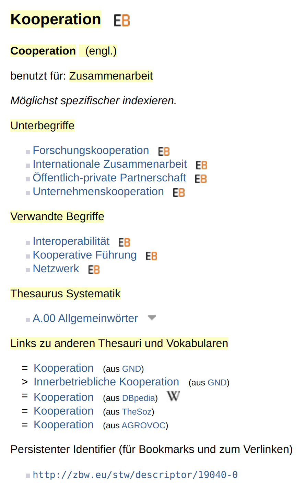

# Kodierung

Wie in der Einleitung erwähnt, wird SKOS im graph-basierten Datenmodell RDF kodiert. Wir verwenden für die Code-Schnipsel im folgenden Beispiel die RDF-Serialisierung [Turtle](https://format.gbv.de/rdf/turtle), weil diese am besten lesbar ist. 

## RDF/Turtle

In der einfachsten Form werden in Turtle die RDF-Tripel (Subjekt, Prädikat, Objekt) direkt hintereinander mit Leerzeichen getrennt in eine Zeile geschrieben und mit einem Punkt abgeschlossen. Hier ein allgemeines Beispiel (mit [DC Terms](https://www.dublincore.org/specifications/dublin-core/dcmi-terms/) statt SKOS):

Die folgenden beiden Tripel...

| Subjekt                         | Prädikat      | Objekt       |
| ------------------------------- | ------------- | ------------ |
| `<http://example.org/beispiel>` | `dct:creator` | `"Anne"`     |
| `<http://example.org/beispiel>` | `dct:title`   | `"Beispiel"` |

werden in der einfachsten Form so kodiert:

```turtle
<http://example.org/beispiel> dct:creator "Anne" .
<http://example.org/beispiel> dct:title "Beispiel" .
```

Zur besseren Lesbarkeit verwenden wir im Folgenden eine verkürzte Form, wenn es mehrere Aussagen zum selben Subjekt gibt (Prädikat-Objekt-Paare mit Semikolon getrennt und mit Leerzeichen eingerückt):

```turtle
<http://example.org/beispiel>
    dct:creator "Anne" ;
    dct:title "Beispiel .
```

Und wenn es mehrere Objekte zu einem Prädikat gibt – wie beispielsweise einen weiteren Tripel mit dem Autor Ich (`<http://example.org/beispiel>` `dct:creator` `"Ich"`) – dann nutzen wir die folgende verkürzte Form (mehrere Objekte mit Komma getrennt):

```turtle
<http://example.org/beispiel>
    dct:creator "Anne", "Ich" ;
    dct:title "Beispiel .
```

## Beispiel Standard-Thesaurus Wirtschaft

Nun zu einem konkreten Beispiel für ein kontrolliertes Vokabular. Die Webseite zum Begriff [Kooperation im Standard-Thesaurus Wirtschaft](https://via.hypothes.is/https://zbw.eu/stw/version/latest/descriptor/19040-0/about.de.html) sieht wie folgt aus (auf die gelb markierten Wörter gehen wir gleich im Einzelnen ein):



### Kooperation / Cooperation

Der Eintrag im Thesaurus hat den **Identifier** <http://zbw.eu/stw/descriptor/19040-0>. Dieser wird in SKOS als Ausgangspunkt genutzt (und nicht etwa der Name des Eintrags).

Die Hauptbezeichnung (**Kooperation** bzw. **Cooperation**) wird dann mit `skos:prefLabel` ergänzt.

Die verschiedenen **Sprachen** werden gemäß RDF/Turtle durch den Anhang `@de` bzw. `@en` definiert.

```turtle
<http://zbw.eu/stw/descriptor/19040-0>
    skos:prefLabel "Cooperation"@en, "Kooperation"@de .
```

### Zusammenarbeit

Alternative Bezeichnungen werden mit `skos:altLabel` ergänzt.

```turtle
<http://zbw.eu/stw/descriptor/19040-0>
    skos:altLabel "Zusammenarbeit"@de .
```

### Unterbegriffe

* Forschungskooperation
* Internationale Zusammenarbeit
* Öffentlich-private Partnerschaft
* Unternehmenskooperation

Zur Abbildung von Hierarchien wird in SKOS das Paar `skos:broader` ("hat einen Oberbegriff") und `skos:narrower` ("hat einen Unterbegriff") verwendet. In der fertigen Datei sollten immer beide Richtungen definiert sein, also hier im Beispiel:

* Kooperation hat den Unterbegriff (`skos:narrower`) Forschungskooperation
* Forschungskooperation hat den Oberbegriff (`skos:broader`) Kooperation

Wenn aber eine Software für die Erstellung des SKOS-Vokabulars verwendet wird, dann reicht es meist aus nur eine Richtung zu definieren, weil die andere Richtung dann automatisch von der Software ergänzt wird.

Die vier Unterbegriffe im Eintrag Kooperation würden also wie folgt definiert:

```turtle
<http://zbw.eu/stw/descriptor/19040-0>
    skos:narrower <http://zbw.eu/stw/descriptor/12036-5>, <http://zbw.eu/stw/descriptor/18775-0>, <http://zbw.eu/stw/descriptor/18822-3>, <http://zbw.eu/stw/descriptor/19708-3> .
```

### Verwandte Begriffe

* Interoperabilität
* Kooperative Führung
* Netzwerk

Falls die Begriffe nicht in einer direkten Hierarchie zueinander stehen, sondern nur irgendwie miteinander verbunden sind, dann wird das Prädikat `skos:related` verwendet.

```turtle
<http://zbw.eu/stw/descriptor/19040-0>
    skos:related <http://zbw.eu/stw/descriptor/12580-3>, <http://zbw.eu/stw/descriptor/18657-6>, <http://zbw.eu/stw/descriptor/20402-3> .
```

### Thesaurus Systematik

* A. 00 Allgemeinwörter

Für die Dokumentation einer Notation gibt es eigentlich das spezifische Prädikat `skos:notation`. Da die Systematikstelle im Standard-Thesaurus Wirtschaft aber eben auch eine Art Überordnung darstellt, haben sich die Autor*innen dazu entschieden, diese schlicht mit `skos:broader` zu definieren. In unserem Beispiel wird die Systematikstelle also wie folgt definiert:

```turtle
<http://zbw.eu/stw/descriptor/19040-0>
    skos:broader <http://zbw.eu/stw/thsys/70582> .
```

Auf der Webseite werden die Verweise mit `skos:broader` unter zwei Überschriften ("Oberbegriffe" und "Thesaurus Systematik") gruppiert. Wahrscheinlich erfolgt diese Gruppierung dynamisch anhand des Adressbestandteils (Oberbegriffe = `/descriptor` und Thesaurus Systematik =  `/thsys`).

### Links zu anderen Thesauri und Vokabularen

* = Kooperation (aus GND)
* = Kooperation (aus DBpedia)
* = Kooperation (aus TheSoz)
* = Kooperation (aus AGROVOC)

Für Links zu externen SKOS-Vokabularen gibt es gleich drei Prädikate, um die Genauigkeit der Übereinstimmung zu definieren: `skos:relatedMatch`, `skos:closeMatch` und `skos:exactMatch`. Die Autor*innen gehen hier von einer exakten Übereinstimmung aus und deshalb wird vom Standard-Thesaurus Wirtschaft `skos:exactMatch` für die Links zu externen Vokabularen verwendet:

```turtle
<http://zbw.eu/stw/descriptor/19040-0>
    skos:exactMatch <http://aims.fao.org/aos/agrovoc/c_1855>, <http://dbpedia.org/resource/Cooperation>, <http://lod.gesis.org/thesoz/concept_10042918>, <https://d-nb.info/gnd/4032386-9> .
```

Die Quellenangabe `(aus DBpedia)` steht nicht explizit in der SKOS-Datei. Wahrscheinlich erfolgt die Darstellung auf der Webseite auch hier wieder über eine Auswertung des Adressbestandteils im Identifier mit Hilfe einer Übersetzungstabelle, also beispielsweise dbpedia.org -> "(aus DBpedia)".

## Technischer Aufbau

Neben den im obigen Beispiel verwendeten Elementen bedarf es noch ein paar allgemeiner Definitionen, um eine valide Datei mit dem SKOS-Vokabular zu erstellen.

Zunächst muss das Vokabular `skos:ConceptScheme` an sich einmalig definiert werden (auch wenn es wie hier im Beispiel nur einen Begriff enthält).

```turtle
<http://zbw.eu/stw>
    a skos:ConceptScheme ;
    skos:prefLabel "Standard-Thesaurus Wirtschaft" .
```

Weiterhin muss jeder Begriff als `skos:Concept` definiert und explizit dem Vokabular zugeordnet (`skos:inScheme`) werden:

```turtle
<http://zbw.eu/stw/descriptor/19040-0>
    a skos:Concept ;
    skos:inScheme <http://zbw.eu/stw> .
```

Und um die Identifier nicht immer vollständig wiederholen zu müssen, gibt es Abkürzungen. Dazu wird oft zu Beginn eine Basis-URL definiert:

```turtle
@base <http://zbw.eu/stw/descriptor/> .
```

Schließlich müssen wie bei RDF üblich müssen die verwendeten Vokabulare einmal definiert werden. Das erfolgt in Turtle so:

```turtle
@prefix rdf: <http://www.w3.org/1999/02/22-rdf-syntax-ns#> .
@prefix skos: <http://www.w3.org/2004/02/skos/core#> .
```

## Vollständiges Beispiel

Unser obiges Beispiel könnte im Format RDF/Turtle also so aussehen:

```turtle
@base <http://zbw.eu/stw/descriptor/> .
@prefix rdf: <http://www.w3.org/1999/02/22-rdf-syntax-ns#> .
@prefix skos: <http://www.w3.org/2004/02/skos/core#> .

<http://zbw.eu/stw> a skos:ConceptScheme ;
    skos:prefLabel "Standard-Thesaurus Wirtschaft" .

<19040-0> a skos:Concept ;
    skos:prefLabel "Cooperation"@en, "Kooperation"@de ;
    skos:altLabel "Zusammenarbeit"@de ;
    skos:narrower <12036-5>, <18775-0>, <18822-3>, <19708-3> ;
    skos:related <12580-3>, <18657-6>, <20402-3> ;
    skos:exactMatch <http://aims.fao.org/aos/agrovoc/c_1855>, <http://dbpedia.org/resource/Cooperation>, <http://lod.gesis.org/thesoz/concept_10042918>, <https://d-nb.info/gnd/4032386-9> ;
    skos:inScheme <http://zbw.eu/stw> .
```

Die vom Standard-Thesaurus Wirtschaft [angebotene Datei](https://zbw.eu/stw/version/latest/descriptor/19040-0/about.ttl) sieht im Übrigen noch etwas anders aus. Sie enthält noch weitere Infos, die in der HTML-Darstellung nicht zu sehen sind (z.B. eine Nummer im Bibliothekskatalog `gbv:gvkppn` und interne Daten wie z.B. `zbwext:indexedItem`). Außerdem ist der Aufbau etwas technischer, weil die Datei generiert und nicht "von Hand" geschrieben wurde. So werden beispielsweise am Anfang viele Präfixe definiert, die für diesen konkreten Begriff gar nicht verwendet werden.
