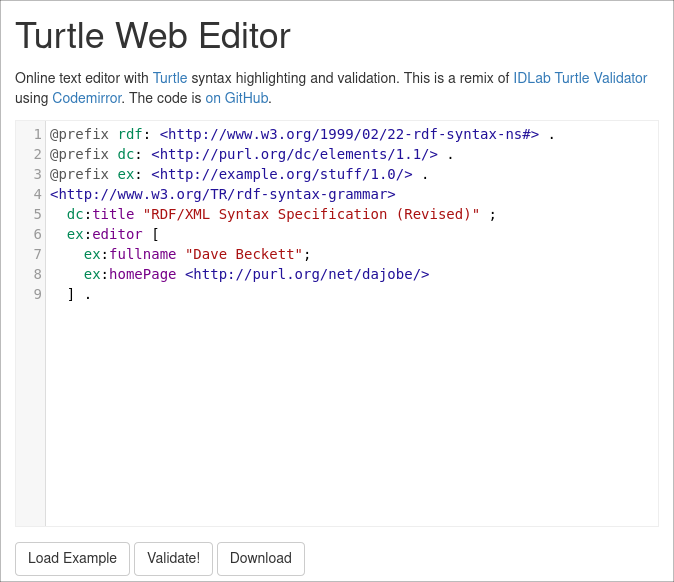

# Tutorial

In diesem Tutorial erstellen und veröffentlichen wir ein eigenes fiktives SKOS-Vokabular. Versetzen Sie sich dazu gedanklich in folgendes Szenario:

* Eine kleine Hochschule betreibt einen Dokumentenserver für Abschlussarbeiten.
* Auf der Webseite des Dokumentenservers sollen Nutzer\*innen nach Fachbereichen und Studiengängen filtern können.
* Der Dokumentenserver wird in zwei Sprachen (deutsch und englisch) angeboten.
* Zu statistischen Zwecken werden die Studiengänge der DESTATIS Hochschulfächersystematik zugeordnet.

Um die Erschließung der Dokumente zu vereinheitlichen, soll die Fachsystematik (Fachbereiche und Studiengänge) in einem SKOS-Vokabular kontinuierlich gepflegt werden.

## Beispieldaten

Die fiktive Hochschule hat aktuell folgende Studienangebote:

* Fachbereich Bauwesen (Civil Engineering)
  * Bachelor Bauingenieur- und Umweltingenieurwesen (Civil and Environmental Engineering)
  * Master Bauingenieurwesen (Civil Engineering)
  * Master Wasser- und Umweltingenieurwesen (Water and Environmental Engineering)
* Fachbereich Maschinenbau (Mechanical Engineering)
  * Bachelor Maschinenbau (Mechanical Engineering)
  * Master Mechatronics (Mechatronics)
  * Master Schiffbau und Meerestechnik (Naval Architecture and Ocean Engineering)
* Fachbereich Verfahrenstechnik (Process and Chemical Engineering)
  * Bachelor Verfahrenstechnik (Process Engineering)
  * Bachelor Bioverfahrenstechnik (Bioprocess Engineering)

Die Diplomstudiengänge Bauingenieurwesen und Umwelttechnik, Maschinenbau sowie Verfahrenstechnik wurden mit der Bologna-Reform zum Sommersemester 2014 eingestellt.

## Erstellung

Wir erstellen unser SKOS-Vokabular in Turtle-Syntax. Lesen Sie dazu den [Abschnitt RDF/Turtle auf der Seite Kodierung](skos-kodierung.md).

Öffnen Sie dann zum Schreiben den [Turtle Web Editor](https://felixlohmeier.github.io/turtle-web-editor/) oder einen anderen Texteditor ihrer Wahl.

[](https://felixlohmeier.github.io/turtle-web-editor/)

Über den Button "Validate!" können Sie jederzeit prüfen, ob der eingegebene Text korrekte Turtle-Syntax ist. Für die Validierung des SKOS-Vokabulars verwenden wir später noch ein anderes Tool.

### 1. Dateibeginn

Wie bei RDF üblich müssen zu Beginn der Datei die verwendeten Vokabulare einmal definiert werden. Und um die verwendeten Identifier nicht immer vollständig wiederholen zu müssen, wird meist zu Beginn eine Basis-URL definiert:

```turtle
@base <http://www.example.org/> .
@prefix rdf: <http://www.w3.org/1999/02/22-rdf-syntax-ns#> .
@prefix skos: <http://www.w3.org/2004/02/skos/core#> .
@prefix dct: <http://purl.org/dc/terms/> .
```

### 2. Vokabular

Danach definieren wir mit `skos:ConceptScheme` unser Vokabular. Für die Beschreibung des Vokabulars werden in der Regel [DCMI Metadata Terms](https://lov.linkeddata.es/dataset/lov/vocabs/dcterms) (dcterms) verwendet.

```turtle
<scheme> a skos:ConceptScheme ;
  dct:title "Fachsystematik Hochschule ..."@de ;
  dct:description "Fachbereiche und Studiengänge für den Dokumentenserver"@de .
```

Ergänzen Sie mit dem Element `dct:issued` noch ein fiktives Datum.

### 3. Begriffe

Als ersten Begriff `skos:Concept` definieren wir einen der Fachbereiche. Diese stehen auf der obersten Ebene und werden daher über `skos:topConceptOf` dem Vokabular (`skos:ConceptScheme`) zugeordnet.

```turtle
<bauwesen> a skos:Concept ;
  skos:prefLabel "Bauwesen"@de, "Civil Engineering"@en ;
  skos:topConceptOf <scheme> .
```

Der präferierte Text für die Anzeige wird mit `skos:prefLabel` festgelegt. Durch die Tags `@de` bzw. `@en` wird die Mehrsprachigkeit definiert.

Als zweiten Begriff definieren wir einen der Studiengänge. Wenn der Begriff nicht auf der obersten Ebene steht, dann wird `skos:inScheme` statt `skos:topConceptOf` für die Zuordnung zum Vokabular verwendet.

```turtle
<bauingenieurwesen> a skos:Concept ;
  skos:prefLabel "Bauingenieurwesen (Master)"@de, "Civil Engineering (Master)"@en ;
  skos:inScheme <scheme> .
```

Ergänzen Sie die weiteren Begriffe aus den obigen Beispieldaten.

### 4. Hierarchien

Um Hierarchien festzulegen, gibt es die Elemente `skos:broader` und `skos:narrower` je nach Blickrichtung. Diese Verben sind als "hat die Überordnung" bzw. "hat die Unterordnung" zu lesen.

a) Der Studiengang Bauingenieurwesen ist ein Teil des Fachbereichs Bauwesen:

```turtle
<bauingenieurwesen> skos:broader <bauwesen> .
```

b) Der Fachbereich Bauwesen beinhaltet den Studiengang Bauingenieurwesen:

```turtle
<bauwesen> skos:narrower <bauingenieurwesen> .
```

Ergänzen Sie in allen Begriffen die hierarchischen Relationen. Beispiel:

```turtle
<bauwesen> a skos:Concept ;
  skos:prefLabel "Bauwesen"@de, "Civil Engineering"@en ;
  skos:narrower <bauingenieurwesen> ;
  skos:topConceptOf <scheme> .
```

### 5. Externe Links

Ein Vorteil von SKOS ist die Möglichkeit, maschinenlesbare Bezüge zu anderen Vokabularen herzustellen. In unserem Szenario sollen zu statistischen Zwecken die Studiengänge der DESTATIS Hochschulfächersystematik zugeordnet werden. Diese Systematik [liegt bei SkoHub bereits als SKOS-Vokabular vor](https://w3id.org/kim/hochschulfaechersystematik/scheme), so dass wir direkt darauf verlinken können.

In SKOS können dazu verschiedene Elemente verwendet werden, darunter `skos:exactMatch` für eine exakte Übereinstimmung oder `skos:closeMatch` für eine Ähnlichkeit. Äquivalent zu "broader" bzw. "narrower" können mit `skos:broadMatch` und `skos:narrowMatch` auch hierarchische Beziehungen zu externen Vokabularen definiert werden.

In unserem Beispiel gibt es exakte Übereinstimmungen. Beispiel:

```turtle
<bauwesen> skos:exactMatch <https://w3id.org/kim/hochschulfaechersystematik/n68> .
```

Recherchieren Sie in der Hochschulfächersystematik die passenden Einträge und ergänzen Sie diese in allen Begriffen.

### 6. Kollektionen

Nehmen wir an, dass in unserem Vokabular systematisch zwischen Bachelor und Master unterschieden werden soll. Wir haben das zwar oben im Label mit angegeben...

```turtle
skos:prefLabel "Bauingenieurwesen (Master)"@de
```

... aber für eine Suchoberfläche ist es einfacher auszuwerten, wenn es strukturiert definiert wird. SKOS bietet mit `skos:Collection` und `skos:OrederedCollection` die Möglichkeit, Sammlungen zu definieren. Diese werden eher selten verwendet und zwar meist dann wenn die Sammlung nicht selbst ein Begriff im Vokabular sein darf und eine zusätzliche Kategorisierungsebene benötigt wird.

Beispiel:

```turtle
<master> a skos:Collection ;
    skos:prefLabel "Master" ;
    skos:member <bauingenieurwesen> .
```

Ergänzen Sie eine Sammlung aller Bachelor-Studiengänge und eine Sammlung aller Master-Studiengänge.

### 7. Dokumentation

Um den Nutzer\*innen des Vokabulars die Erschließung zu erleichtern oder um als Bearbeiter\*in des Vokabulars eine Gedächtnisstütze zu hinterlegen bietet SKOS zahlreiche Elemente für Notizen und Erläuterungen.

Nehmen wir an, dass wir den Begriff `<bauingenieurwesen>` früher für den Diplomstudiengang verwendet hatten. Dann könnten wir dies wie folgt dokumentieren:

```turtle
<bauingenieurwesen> skos:historyNote "Gleichnamiger Diplomstudiengang zum Sommersemester 2014 eingestellt." .
```

Auf der Seite [Elemente](skos-elemente.md) finden Sie eine vollständige Liste aller in SKOS verfügbaren Elemente mit kurzen Erläuterungen udn Beispielen.

## Validierung

### Beispiel

Ein mögliches Ergebnis der Aufgaben im obigen Tutorial könnte wie folgt aussehen:

```turtle
@base <http://www.example.org/> .
@prefix rdf: <http://www.w3.org/1999/02/22-rdf-syntax-ns#> .
@prefix skos: <http://www.w3.org/2004/02/skos/core#> .
@prefix dct: <http://purl.org/dc/terms/> .

<scheme> a skos:ConceptScheme ;
  dct:title "Fachsystematik Hochschule ..."@de ;
  dct:issued "2020-05-04" ;
  dct:description "Fachbereiche und Studiengänge für den Dokumentenserver"@de .

<fachbereich/bauwesen> a skos:Concept ;
  skos:prefLabel "Bauwesen"@de, "Civil Engineering"@en ;
  skos:narrower <studiengang/bauingenieurwesen>, <studiengang/bauingenieurwesen-umweltingenieurwesen>, <studiengang/wasserwesen-umweltingenieurwesen> ;
  skos:exactMatch <https://w3id.org/kim/hochschulfaechersystematik/n68> ;
  skos:topConceptOf <scheme> .

<fachbereich/maschinenbau> a skos:Concept ;
  skos:prefLabel "Maschinenbau"@de, "Mechanical Engineering"@en ;
  skos:narrower <studiengang/maschinenbau>, <studiengang/mechatronics>, <studiengang/schiffbau-meerestechnik> ;
  skos:exactMatch <https://w3id.org/kim/hochschulfaechersystematik/n63> ;
  skos:topConceptOf <scheme> .

<fachbereich/verfahrenstechnik> a skos:Concept ;
  skos:prefLabel "Verfahrenstechnik"@de, "Process and Chemical Engineering"@en ;
  skos:narrower <studiengang/verfahrenstechnik>, <studiengang/bioverfahrenstechnik> ;
  skos:exactMatch <https://w3id.org/kim/hochschulfaechersystematik/n63> ;
  skos:topConceptOf <scheme> .

<studiengang/bauingenieurwesen-umweltingenieurwesen> a skos:Concept ;
  skos:prefLabel "Bauingenieur- und Umweltingenieurwesen (Bachelor)"@de, "Civil and Environmental Engineering (Bachelor)"@en ;
  skos:broader <fachbereich/bauingenieurwesen> ;
  skos:exactMatch <https://w3id.org/kim/hochschulfaechersystematik/n017> ;
  skos:closeMatch <https://w3id.org/kim/hochschulfaechersystematik/n457> ;
  skos:inScheme <scheme> .

<studiengang/bauingenieurwesen> a skos:Concept ;
  skos:prefLabel "Bauingenieurwesen (Master)"@de, "Civil Engineering (Master)"@en ;
  skos:broader <fachbereich/bauingenieurwesen> ;
  skos:historyNote "Gleichnamiger Diplomstudiengang zum Sommersemester 2014 eingestellt." ;
  skos:exactMatch <https://w3id.org/kim/hochschulfaechersystematik/n017> ;
  skos:inScheme <scheme> .

<studiengang/wasserwesen-umweltingenieurwesen> a skos:Concept ;
  skos:prefLabel "Wasser- und Umweltingenieurwesen (Master)"@de, "Water and Environmental Engineering (Master)"@en ;
  skos:broader <fachbereich/bauingenieurwesen> ;
  skos:exactMatch <https://w3id.org/kim/hochschulfaechersystematik/n094> ;
  skos:closeMatch <https://w3id.org/kim/hochschulfaechersystematik/n457> ;
  skos:inScheme <scheme> .

<studiengang/maschinenbau> a skos:Concept ;
  skos:prefLabel "Maschinenbau (Bachelor)"@de, "Mechanical Engineering (Bachelor)"@en ;
  skos:broader <fachbereich/maschinenbau> ;
  skos:exactMatch <https://w3id.org/kim/hochschulfaechersystematik/n104> ;
  skos:inScheme <scheme> .

<studiengang/mechatronics> a skos:Concept ;
  skos:prefLabel "Mechatronics (Master)"@de, "Mechatronics (Master)"@en ;
  skos:broader <fachbereich/maschinenbau> ;
  skos:exactMatch <https://w3id.org/kim/hochschulfaechersystematik/n104> ;
  skos:inScheme <scheme> .

<studiengang/schiffbau-meerestechnik> a skos:Concept ;
  skos:prefLabel "Schiffbau und Meerestechnik (Master)"@de, "Naval Architecture and Ocean Engineering (Master)"@en ;
  skos:broader <fachbereich/maschinenbau> ;
  skos:exactMatch <https://w3id.org/kim/hochschulfaechersystematik/n142> ;
  skos:inScheme <scheme> .

<studiengang/verfahrenstechnik> a skos:Concept ;
  skos:prefLabel "Verfahrenstechnik (Bachelor)"@de, "Process Engineering (Bachelor)"@en ;
  skos:broader <fachbereich/verfahrenstechnik> ;
  skos:exactMatch <https://w3id.org/kim/hochschulfaechersystematik/n226> ;
  skos:inScheme <scheme> .

<studiengang/bioverfahrenstechnik> a skos:Concept ;
  skos:prefLabel "Bioverfahrenstechnik (Bachelor)"@de, "Bioprocess Engineering (Bachelor)"@en ;
  skos:broader <fachbereich/verfahrenstechnik> ;
  skos:exactMatch <https://w3id.org/kim/hochschulfaechersystematik/n226> ;
  skos:closeMatch <https://w3id.org/kim/hochschulfaechersystematik/n282> ;
  skos:inScheme <scheme> .

<bachelor> a skos:Collection ;
  skos:prefLabel "Bachelor" ;
  skos:member <studiengang/bauingenieurwesen-umweltingenieurwesen>, <studiengang/maschinenbau>, <studiengang/verfahrenstechnik>, <studiengang/bioverfahrenstechnik> .

<master> a skos:Collection ;
  skos:prefLabel "Master" ;
  skos:member <studiengang/bauingenieurwesen>, <studiengang/wasserwesen-umweltingenieurwesen>, <studiengang/mechatronics>, <studiengang/schiffbau-meerestechnik> .
```

Weil Bauwesen sowohl der Name eines Fachbereichs als auch eines Studiengangs ist, wurden hier bei den Identifiern Präfixe verwendet (`fachbereich/` bzw. `/studiengang/`).

Optimierte SKOS-Vokabulare enthalten direkte beidseitige Verknüpfungen, um die maschinelle Nutzung zu beschleunigen. So müsste bei der folgenden Validierung unter anderem auffallen, dass wir zwar die Begriffe auf der obersten Ebene mit `skos:topConceptOf` dem Schema zugeordnet haben. Das Gegenstück `skos:hasTopConcept` fehlt aber noch im Schema.

### Skosify

http://demo.seco.tkk.fi/skosify/skosify

### SKOS testing tool

http://labs.sparna.fr/skos-testing-tool/

## Visualisierung

mit SKOS Play...

http://labs.sparna.fr/skos-play/

## Veröffentlichung

Für die Bereitstellung im Web wird eine spezialisierte Software benötigt...

ausgehend aus der Turtle-Datei...

mit Skosmos... http://skosmos.org

mit SkoHub Vocabs... https://skohub.io